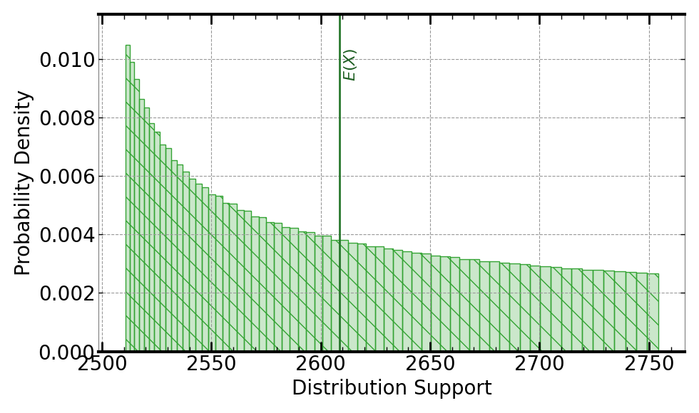
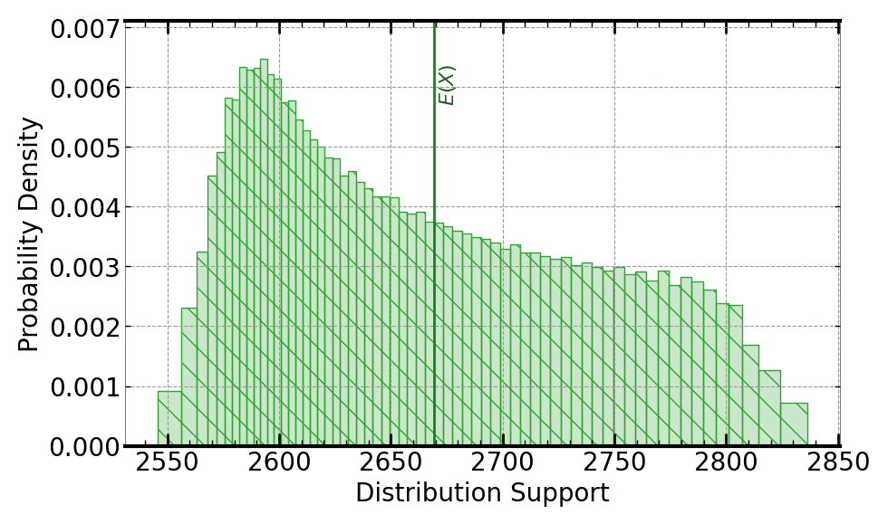

[](https://signaloid.io/repositories?connect=https://github.com/signaloid/Signaloid-Demo-Sensors-FlussoFLS110ConversionRoutines#gh-dark-mode-only)
[](https://signaloid.io/repositories?connect=https://github.com/signaloid/Signaloid-Demo-Sensors-FlussoFLS110ConversionRoutines#gh-light-mode-only)

# Flusso FLS110 Sensor Calibration Use Case
Example demonstrating real-time output uncertainty estimation for calibrated ADC values from the Flusso FLS110 sensor[^1].

## Introduction
The FLS110 is an analogue mass flow sensor.

## Getting started

The correct way to clone this repository to get the submodules is:
```sh
	git clone --recursive git@github.com:signaloid/Signaloid-Demo-Sensors-FlussoFLS110ConversionRoutines.git
```

If you forgot to clone with `--recursive` and end up with empty submodule directories, you can remedy this with:
```sh
	git submodule update --init
```

## Running the application locally
Apart from using Signaloid's Cloud Compute Platform, you can compile and run this application
locally. Local execution is essentially a native Monte Carlo implementation,
that uses GNU Scientific Library (GSL)[^2] to generate samples for the different input distributions.
In this mode the application stores the generated output samples, in a file called `data.out`.
The first line of `data.out` contains the execution time of the Monte Carlo implementation
in microseconds (μs), and each
next line contains a floating-point value corresponding to an output sample value.
Please note, that for the Monte Carlo output mode, you need to select a single output
to calculate, using (`-S`) command-line option.

In order to compile and run this application in the native Monte Carlo mode:

0. Install dependencies (e.g., on Linux):
```
sudo apt-get install libgsl-dev libgslcblas0
```
1. Compile natively (e.g., on Linux):
```
cd src/
gcc -I. -I/opt/local/include main.c utilities.c common.c uxhw.c -L/opt/local/lib -o native-exe -lgsl -lgslcblas -lm
```
2. Run the application in the MonteCarlo mode, using (`-M`) command-line option:
```
./native-exe -M 10000 -S 0
```
The above program runs 10000 Monte Carlo iterations, calculating the output chosen by (`-S 0`) command-line option.
3. See the output samples generated by the local Monte Carlo execution:
```
cat data.out
```

## Inputs
The inputs to the FLS110 sensor conversion algorithms are the heat power transfer of the gas in flow
in Watts ($h$),
the temperature flow in Kelvin measured by the firmware ($T_{flow}$), the temerature in Kelvin when the zero-point offset was determined ($T_0$), the pressure flow in Pascal measured by the firmware ($P_{flow}$) and the pressure in
Pascal when the zero-point offset was determined ($P_0$). The algorithm models the uncertainty in the
above quantities using uniform distributions.

The uncertainty in $h$ is modeled as a (`UniformDist(0.01, 0.05)`) Watts.

The uncertainty in $T_{flow}$ is modeled as a (`UniformDist(293.0, 294.0)`) Kelvin.

The uncertainty in $T_0$ is modeled as a (`UniformDist(273.0, 273.5)`) Kelvin.

The uncertainty in $P_{flow}$ is modeled as a (`UniformDist(420.0, 425.0)`) kPa.

The uncertainty in $P_0$ is modeled as a (`UniformDist(400.0, 405.0)`) kPa.


## Outputs
The output can be the calibrated Mass Flow output in sccm ($MassFlow$) or the Differential Pressure in Pascal
($DP$). Select between the different outputs using the `-S` command-line parameter:
- `-S 0`: Calculates the calibrated Mass Flow output of the FLS110 sensor, given by
```math
\mathrm{Mass Flow} = C_3 h^3 + C_2h^2 + C_1h
```
where $C_1$, $C_2$, and $C_3$ are constants:
```math
\mathrm{C_1}=2499.26
```
```math
\mathrm{C_2}=117682.20
```
```math
\mathrm{C_3}=-314364.00
```

Following is an example output, using Signaloid's C0Pro-S+ core:



- `-S 1`: Calculates the calibrated Differential Pressure output of the FLS110 sensor, given by
```math
\mathrm{DP} = MassFlow * \frac{T_{flow}}{T_0} * \frac{P_0}{P_{flow}}
```

Following is an example output, using Signaloid's C0Pro-S core:



- `-S 2`: Calculates all previous calibrated outputs. Selected by default.


## Usage
```
Example: FlussoFLS110 sensor conversion routines - Signaloid version

	[-o, --output <Path to output CSV file : str>] (Specify the output file.)
	[-S, --select-output <output : int>] (Compute 0-indexed output. Calculate all possible outputs if equal to 2. Default value: 2.)
	[-M, --multiple-executions <Number of executions : int (Default: 1)>] (Repeated execute kernel for benchmarking.)
	[-T, --time] (Timing mode: Times and prints the timing of the kernel execution.)
	[-b, --benchmarking] (Benchmarking mode: Generate outputs in format for benchmarking.)
	[-j, --json] (Print output in JSON format.)
	[-h, --help] (Display this help message.)
```


---

[^1]: [FLS110 Datasheet](https://www.farnell.com/datasheets/3625949.pdf).

